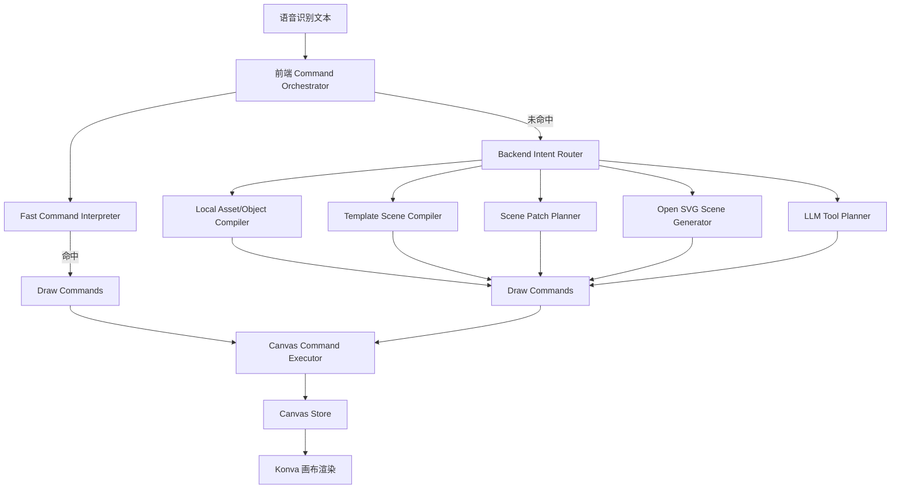

# Design Doc：Voice Canvas 指令能力设计与实现说明

> 项目：Voice Canvas：基于分层意图路由与命令执行架构的 AI 语音绘图工具
> 比赛：七牛云 × XEngineer 暑期实训营 第 4 批次  
> 题目二：AI 语音绘图工具

## 1. 文档目的

本文档记录 Voice Canvas 在设计阶段计划支持的语音指令能力、最终实际完成的能力，以及尚未完成部分的原因说明。

Voice Canvas 的目标不是简单地把语音文本交给大模型生成图片，而是构建一个可解释、可控、可降级的语音绘图系统。系统需要让用户用自然语言完成基础图形绘制、对象编辑、场景生成、目标选择和画布控制。

## 2. 设计目标

### 2.1 核心目标

- 支持中文语音输入并转换为绘图指令。
- 支持基础图形和常见对象创建。
- 支持自然语言编辑已有对象。
- 支持“它”“刚才那个”“左边的树”等语义选择。
- 支持场景级创作，例如“画一个公园”“画一个海边日落”。
- 支持画布控制，例如撤销、重做、保存、导出、清空。
- 支持 LLM 增强理解，但简单命令不依赖 LLM。
- 支持必要的降级机制，保证演示稳定性。

### 2.2 工程目标

- 将语音识别、意图理解、工具规划、命令执行和画布渲染解耦。
- 避免 LLM 直接操作画布，统一收敛到结构化绘图命令。
- 对不确定目标进行歧义提示，避免误操作。
- 让模板场景生成结果由多个可编辑对象组成；开放式 SVG 场景则作为整图 image 进入画布，用于更自由的视觉表达。

## 3. 指令能力规划

设计阶段将指令能力分为六类：

| 指令类别 | 计划支持能力 | 示例 |
| --- | --- | --- |
| 基础绘图 | 创建圆、矩形、线、文字、星形等基础图形 | `画一个红色圆形` |
| 对象创建 | 创建树、房子、云、太阳、礼物、蛋糕等常见对象 | `画一棵树` |
| 对象编辑 | 改色、移动、缩放、删除、选择 | `把它变成蓝色` |
| 语义选择 | 根据上下文、空间、大小和语义选择对象 | `选中左边的树` |
| 场景创作 | 一句话生成完整场景 | `画一个公园` |
| 画布控制 | 撤销、重做、保存、导出、清空 | `撤销` |

## 4. 分层意图路由与命令执行设计

系统采用分层意图路由与命令执行架构。当前实现不是单一线性分层，而是由前端编排器、前端快速解释器、后端意图路由器、多个后端 Planner / Compiler 和前端 Canvas Command Executor 共同组成。



### 前端快速命令解释

计划用于处理确定性强、频率高、不需要 LLM 的命令。

最终实现：

- 基础图形创建：圆、矩形、线、星形、文字。
- 常见颜色解析：红、蓝、绿、黄、黑、白、紫、粉、橙等。
- 常见编辑：改色、放大、缩小、上下左右移动、移动到边角。
- 画布控制：撤销、重做、清空、保存、导出。
- 语音控制：停止识别、继续识别。
- 快速目标选择：当前对象、最近对象、语义对象。

### 后端意图路由与本地规划

后端 `Intent Router` 负责轻量分类，不直接执行画布操作。它会将请求分配到本地素材对象、固定场景模板、Scene Patch、开放式 SVG 场景或 LLM 工具规划。

固定场景模板用于处理稳定的常见场景，让比赛演示中的复杂场景生成更可靠。
模板场景和 Scene Patch 输出 `render_mode=object_scene`，由多个带语义标签的对象组成，可以继续对象级编辑；开放式 SVG 场景输出 `render_mode=svg_image`，在画布上是一张整图 image，不承诺拆分为可独立编辑对象。前端模板快捷识别消费后端 `/api/voice/scene-manifest`，模板别名以后端为权威来源。

最终实现：

- 海边日落。
- 公园。
- 生日贺卡。
- 城市夜景。
- 森林小屋。
- 山水风景。
- 教室。
- 温馨客厅。
- 桌面工作区。
- 节日派对。

实现方式：

- `templates.py` 定义场景对象、层级、位置、颜色和角色。
- `SceneCommandCompiler` 将场景计划转换为前端可执行命令。
- 场景对象保留 `kind`、`label`、`role` 等语义信息，便于后续继续编辑。

### LLM 增强规划

计划用于处理开放式对象创建、复杂编辑和模板无法覆盖的自然语言请求。当前 LLM 路径分为两类：开放式 SVG 整图生成，以及 Function Calling 风格的工具规划。

最终实现：

- 使用 OpenAI 兼容接口调用 LLM。
- 使用 Function Calling 风格 JSON 工具协议。
- 支持 `create_object`、`edit_object`、`delete_object`、`control_canvas`、`ask_clarification`、`ignore_input`。
- 使用 Pydantic 校验工具参数。
- 使用 `DrawingCommandCompiler` 将工具计划转换为画布命令。
- 支持 SVG 素材解析与匹配。
- 支持目标查询和歧义候选返回。

## 5. Function Calling 能力设计

设计阶段希望所有复杂语音指令都被转化为可校验、可执行的工具调用。

### 5.1 工具定义

| 工具 | 设计用途 | 实现状态 |
| --- | --- | --- |
| `create_object` | 创建对象 | 已实现 |
| `edit_object` | 修改对象 | 已实现 |
| `delete_object` | 删除对象 | 已实现 |
| `control_canvas` | 控制画布 | 已实现部分能力 |
| `ask_clarification` | 信息不足时追问 | 已实现 |
| `ignore_input` | 忽略无关输入 | 已实现 |

### 5.2 未完全实现的工具能力

`control_canvas` 在后端执行器中主要实现了 `undo`、`redo`、`clear`，而保存和导出更多由前端快速命令处理。

原因：

- 保存和导出依赖前端当前 Stage、浏览器文件下载和用户界面状态。
- 这类操作放在前端更直接、更稳定。
- 后端 LLM 不需要参与高频画布控制操作。

## 6. 语义选择器能力设计

语义选择器用于解决自然语言目标引用问题。

### 6.1 计划支持

- 最近创建对象：`把它变大`。
- 当前选中对象：用户先点击，再说 `变成蓝色`。
- 类型匹配：`选中树`。
- 空间匹配：`左边的云`、`右边的树`。
- 大小匹配：`最大的气球`。
- 场景角色匹配：背景、前景、装饰元素。
- 多候选歧义提示。
- 候选对象高亮。

### 6.2 最终实现

| 能力 | 实现状态 | 说明 |
| --- | --- | --- |
| 最近对象选择 | 已实现 | 记录 `lastCreatedObjectId`、`lastModifiedObjectId` |
| 当前选中对象 | 已实现 | 前端维护 `selectedObjectId` |
| 语义别名匹配 | 已实现 | 基于 `kind`、`label`、`semanticAliases` |
| 空间位置匹配 | 已实现 | 支持 left、right、top、bottom、center |
| 最大对象匹配 | 已实现 | 基于对象面积排序 |
| 多候选歧义 | 已实现 | 返回 candidates 和 pending command |
| 高亮候选 | 已实现基础能力 | 前端保存 `disambiguationCandidateIds`，用于候选反馈 |

相关模块：

- `frontend/src/services/objectResolver.ts`
- `frontend/src/services/semanticRegistry.ts`
- `backend/app/drawing/target_resolver.py`
- `frontend/src/stores/canvasStore.ts`

## 7. 降级处理设计

### 7.1 语音识别降级

计划：

```text
百度实时 ASR
    ↓ 不可用、未配置或连接失败
Web Speech API
```

最终实现：

- 已实现百度实时 ASR。
- 已实现浏览器 Web Speech API 降级。
- 已实现连接失败、配置缺失时的 fallback。

### 7.2 指令理解降级

计划：

```text
本地快速命令
    ↓ 未命中
后端本地对象 / 场景模板
    ↓ 未命中
开放式 SVG 整图 / LLM 工具规划
```

最终实现：

- 已实现前端快速命令匹配。
- 已实现后端模板场景路由。
- 已实现 LLM 工具规划。
- 已实现 LLM 未配置时的提示，不会误改画布。
- 已实现模型返回异常时的澄清提示。

## 8. 最终实现能力清单

### 8.1 已完成能力

- 用户登录与认证。
- 画布创建、保存、读取、删除。
- 百度实时语音识别。
- Web Speech API 降级。
- OpenAI 兼容 LLM 配置。
- LLM 连接测试。
- 基础图形创建。
- 常见对象创建。
- SVG 素材对象创建。
- 场景模板生成。
- 场景补丁扩展。
- 开放式 SVG 场景生成。
- 对象选择、移动、缩放、改色、删除。
- 当前对象和最近对象追踪。
- 语义目标解析。
- 多候选歧义处理。
- 撤销、重做、清空。
- 保存画布。
- 导出图片。
- Docker Compose 一键启动。

### 8.2 指令示例

基础绘图：

```text
画一个红色圆形
画一个蓝色矩形
画一条黑色的线
写上文字 Hello
画一颗星星
```

对象编辑：

```text
把它变成蓝色
把左边的树变大
把右边那朵云移到上面
删除最大的气球
选中刚才那个对象
```

场景创作：

```text
画一个公园
画一个海边日落
画一张生日贺卡
画一个城市夜景
```

画布控制：

```text
撤销
重做
保存
导出
清空画布
```

## 9. 未完成能力与原因说明

### 9.1 自定义命令词库

状态：未完成。

原因：

- 当前比赛阶段优先保证核心语音绘图链路完整。
- 自定义词库需要额外的配置 UI、持久化结构和匹配优先级策略。
- 如果处理不好，容易与已有快速命令和 LLM 路由冲突。

### 9.2 多语言指令支持

状态：未完成。

原因：

- 当前项目主要面向中文语音绘图场景。
- 多语言支持需要扩展 ASR 语言配置、颜色词、空间词、对象别名和 Prompt。
- 时间有限，优先保证中文体验稳定。

### 9.3 多人协作

状态：未完成。

原因：

- 多人协作需要 WebSocket 同步、冲突解决、用户光标、对象锁定等机制。
- 这超出了本题核心要求。
- 当前优先实现单用户完整闭环。

### 9.4 画布分享与公开链接

状态：未完成。

原因：

- 需要额外设计访问权限、公开链接、缩略图和部署环境。
- 比赛演示阶段本地运行即可满足展示需求。

### 9.5 更精细的多轮场景编辑

状态：部分完成。

已完成：

- 可以在生成场景后继续编辑对象。
- 可以通过语义选择器选择场景中的对象。
- 支持 Scene Patch 对模板场景进行补充。

未完全完成：

- 对复杂多轮对话的长期语义记忆还不完整。
- 尚未实现完整的对话状态机。

原因：

- 多轮编辑需要更复杂的上下文管理和冲突处理。
- 当前版本优先保证单轮命令和短上下文编辑稳定。

### 9.6 批量对象操作

状态：未完成。

原因：

- 需要明确批量选择语义，例如“所有树”“全部气球”“除了太阳之外”。
- 需要前端支持多选、高亮和批量变换。
- 当前对象选择器主要服务单目标编辑，复杂批量编辑留作扩展。

### 9.7 完整素材版权标注

状态：部分完成。

已完成：

- SVG 素材集中放在 `frontend/public/svg-assets`。
- 使用 manifest 和 Asset Resolver 管理素材语义。

未完成：

- 未对每个 SVG 素材逐项补充来源和许可证。

原因：

- 当前重点是技术功能实现。
- 最终提交前建议按素材来源补充版权说明。

## 10. 设计取舍

### 10.1 为什么不全部交给 LLM？

原因：

- 简单命令使用 LLM 会增加延迟和成本。
- LLM 输出存在不确定性，容易误操作画布。
- 比赛演示需要稳定性。

因此项目采用分层意图路由：

- 高频命令走本地。
- 常见场景走模板。
- 开放式复杂需求才走 LLM。

### 10.2 为什么场景用模板？

原因：

- 模板能保证稳定输出。
- 模板对象可编辑。
- 模板可以保留语义标签，方便后续选择和修改。
- 开放式 SVG 整图用于模板覆盖不到的自由画面表达，优势是画面完整，代价是对象级编辑能力弱。

### 10.3 为什么需要语义选择器？

原因：

- 语音交互中用户很少说对象 ID。
- 用户更自然的表达是“它”“左边那个”“刚才的树”。
- 如果没有选择器，后续编辑能力会非常弱。

### 10.4 为什么使用 Function Calling 风格？

原因：

- 可以约束 LLM 输出。
- 可以校验参数。
- 可以统一执行路径。
- 可以避免模型直接产生不可控画布操作。

## 11. 总结

Voice Canvas 最终实现了一个完整的语音绘图闭环：

```text
语音输入
  → 语音识别
  → 分层意图路由
  → Function Calling / Draw Commands
  → Canvas Command Executor
  → Konva 画布渲染
```

项目的核心完成度集中在：

- 分层意图路由与命令执行架构。
- Function Calling 工具规划。
- 语义选择器。
- 场景模板与场景补丁。
- 降级容错。
- 可编辑画布执行体系。

未完成部分主要集中在协作、分享、多语言、自定义词库和更复杂的长期多轮编辑。这些能力需要更多 UI、状态同步、权限设计和上下文管理，不属于当前比赛题目的最小闭环，因此作为后续扩展方向保留。
