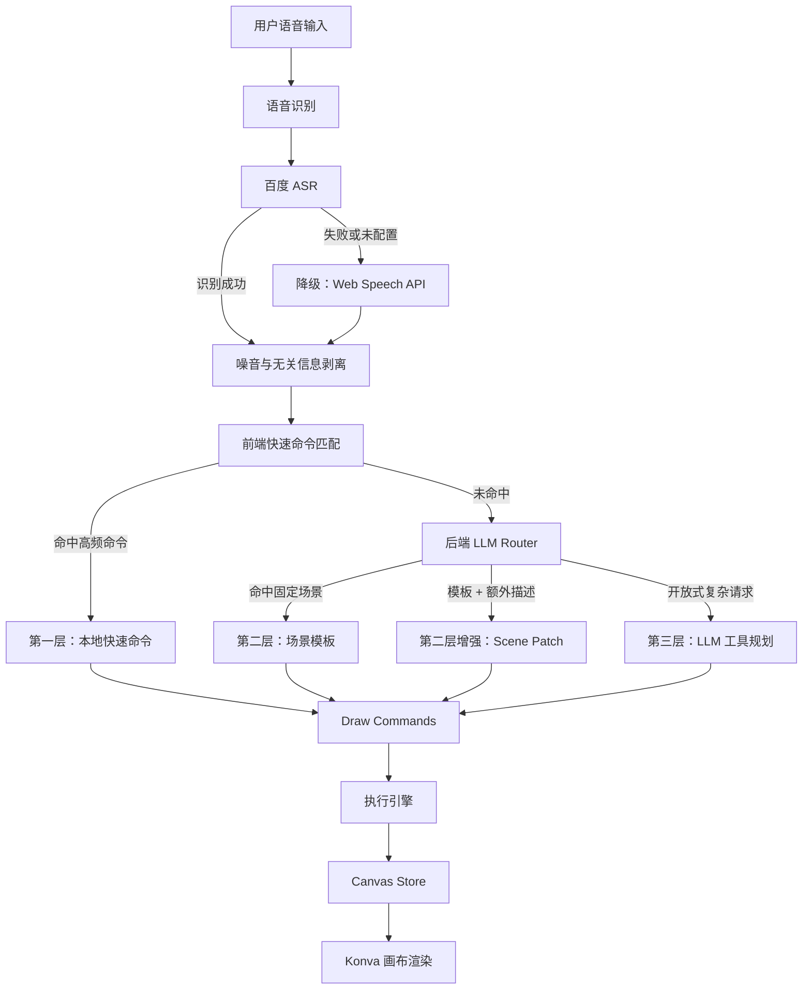
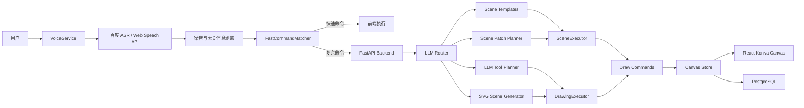

# 🎨 Voice Canvas：基于三层智能路由的 AI 语音绘图工具

> 七牛云 × XEngineer 暑期实训营 第 4 批次<br>
> 题目二：AI 语音绘图工具

Voice Canvas 是一个面向自然语言语音交互的 AI 绘图系统。用户可以直接通过语音控制画布，例如“画一个红色圆形”“把左边的树变大一点”“生成一个海边日落场景”。系统会将语音识别结果转化为结构化绘图意图，再通过本地规则、场景模板和大模型工具规划完成绘图。


## 📹 演示视频 ：哔哩哔哩：https://www.bilibili.com/video/BV1iTJK6hE95/

## ✨ 项目特点

- 🧠 **三层自定义智能路由架构**：本地快速命令、场景模板、LLM 增强理解分层处理。
- 🛠️ **Function Calling 工具规划**：将自然语言转化为受控工具调用，而不是让模型直接操作画布。
- 🎯 **语义选择器系统**：支持“它”“刚才那个”“左边的树”“最大的气球”等上下文选择。
- 🔦 **高亮选择与歧义处理**：存在多个候选目标时，系统可以提示用户进一步确认。
- ⚙️ **Engine / Executor 执行体系**：通过 DrawingExecutor、SceneExecutor、ScenePatchExecutor 和 TransformEngine 分离规划与执行。
- 🛡️ **降级容错设计**：百度 ASR 不可用时降级到 Web Speech API；简单命令不依赖 LLM。
- 🖼️ **场景级创作**：支持公园、海边日落、生日贺卡、城市夜景等完整场景生成。
- 🧩 **可编辑画布对象**：场景不是一张静态图片，而是由多个可继续修改的对象组成。

## 🏆 核心创新与原创部分

### 1. 三层智能路由架构

Voice Canvas 的核心设计是三层语音理解链路。系统不会把所有语音请求都交给大模型，而是根据请求复杂度选择最合适的处理路径。



第一层是前端本地快速命令匹配，负责撤销、重做、保存、导出、基础图形创建、常见改色和移动等高频操作。

语音识别阶段会先尝试百度 ASR，在服务不可用、未配置或识别失败时降级到浏览器 Web Speech API；识别文本进入理解链路前，会先剥离口头噪音、重复词和与绘图无关的信息，降低误触发风险。

第二层是后端场景模板系统，负责处理“画一个公园”“生成海边日落”这类稳定场景请求。

第三层是 LLM 增强理解，负责开放式对象创建、复杂编辑和模板外表达。

### 2. Function Calling / Command Calling 工具协议

本项目将 Function Calling 的思想贯穿三层：无论是本地快速命令、模板场景，还是 LLM 增强理解，最终都会收敛为统一、受控、可执行的绘图命令。

核心工具包括：

- `create_object`：创建对象。
- `edit_object`：编辑对象。
- `delete_object`：删除对象。
- `control_canvas`：控制画布，例如撤销、重做、清空。
- `ask_clarification`：信息不足时追问。
- `ignore_input`：忽略无关输入或语音噪声。

示例：

```json
{
  "calls": [
    {
      "tool": "create_object",
      "confidence": 0.95,
      "arguments": {
        "kind": "tree",
        "render_strategy": "template",
        "position": { "anchor": "left" },
        "size": { "preset": "medium" },
        "style": { "fill": "green" }
      }
    }
  ],
  "response": "好的，我画了一棵树。",
  "reasoning": "用户提出明确绘图请求"
}
```

这种设计的价值是：

- 限制模型输出范围。
- 便于 Pydantic 校验。
- 便于统一转换为前端绘图命令。
- 降低模型幻觉对画布的影响。
- 方便后续扩展新的绘图工具。

### 3. 语义选择器系统

语义选择器是项目的重要原创模块。它解决的是语音绘图中最常见的问题：用户不会总是说对象 ID，而是会说“它”“左边那个”“最大的气球”“刚才画的树”。

系统会根据以下信息建立对象语义档案：

- 对象 ID。
- 图形类型。
- `kind` / `label`。
- SVG 素材别名。
- 场景角色。
- 空间位置。
- 面积大小。
- 当前选中对象。
- 最近创建或修改对象。

选择器会根据语义、上下文和空间位置进行评分。如果出现多个候选目标，系统不会直接误操作，而是进入歧义确认流程，并在前端高亮候选对象。

相关模块：

- `frontend/src/services/objectResolver.ts`
- `frontend/src/services/semanticRegistry.ts`
- `backend/app/drawing/target_resolver.py`

### 4. Engine / Executor 执行体系

项目将“理解”和“执行”拆开，形成一套 Engine / Executor 体系。

后端执行器：

- `DrawingExecutor`：执行 LLM 工具规划，生成标准绘图命令。
- `SceneExecutor`：执行场景模板，生成一组可编辑对象。
- `ScenePatchExecutor`：把用户额外描述作为补丁应用到已有场景。
- `SvgSceneGenerator`：处理开放式 SVG 场景生成。

前端执行器：

- `TransformEngine`：负责对象移动、缩放、边界约束。
- `Canvas Store`：维护对象状态、历史记录、选中对象和最近对象。
- `CanvasBoard`：负责 Konva 画布渲染和手动拖拽交互。

这种拆分让 LLM 只负责规划，真正的画布修改由可控执行器完成。

### 5. 场景规划系统

项目支持场景级语音创作。用户可以说“画一个公园”“画一个生日贺卡”，系统会生成多个具有层级、位置、样式和语义标签的对象。

已支持的场景模板包括：

- 海边日落。
- 公园。
- 生日贺卡。
- 城市夜景。
- 森林小屋。
- 山水风景。
- 教室。
- 温馨客厅。
- 桌面工作区。
- 节日派对。

场景不是单张图片，而是一组可继续编辑的对象。例如生成公园后，用户仍然可以说“把右边的树变大”“删除中间的长椅”。

### 6. 降级容错设计

项目内置两类主要降级策略。

语音识别降级：

```text
百度实时 ASR
    ↓ 失败或未配置
浏览器 Web Speech API
```

命令理解降级：

```text
本地快速命令
    ↓ 未命中
场景模板
    ↓ 未命中
LLM 工具规划
```

这种设计保证了简单命令响应快，常见场景稳定，复杂请求才使用 LLM。

## 🧭 系统架构



## 🧱 技术栈

### 原创架构与核心模块

| 模块 | 说明 |
| --- | --- |
| 三层智能路由 | 根据命令复杂度选择本地、模板或 LLM 路径 |
| Function Calling 工具协议 | 将自然语言收敛为受控工具调用 |
| 语义选择器 | 解析“它”“左边的树”“最大的气球”等目标 |
| 高亮选择与歧义确认 | 多候选目标时避免误操作 |
| Scene Planner | 根据自然语言生成可编辑场景对象 |
| Scene Patch | 在模板场景上应用额外描述 |
| DrawingExecutor | 将工具计划转换为绘图命令 |
| TransformEngine | 处理对象移动、缩放、边界约束 |
| SVG Asset Resolver | 根据 kind、alias、keyword 匹配 SVG 素材 |

### 前端第三方框架与库

| 技术 | 用途 |
| --- | --- |
| React 18 | 前端 UI 框架 |
| TypeScript | 类型系统 |
| Vite | 开发服务器与构建工具 |
| Ant Design | UI 组件库 |
| `@ant-design/icons` | 图标库 |
| Konva | Canvas 绘图库 |
| React Konva | Konva 的 React 绑定 |
| Zustand | 状态管理 |
| Axios | HTTP 请求 |
| React Router DOM | 前端路由 |

### 后端第三方框架与库

| 技术 | 用途 |
| --- | --- |
| Python 3.11 | 后端运行环境 |
| FastAPI | Web API 框架 |
| Uvicorn | ASGI 服务 |
| SQLAlchemy | ORM |
| asyncpg | PostgreSQL 异步驱动 |
| Alembic | 数据库迁移 |
| Pydantic | 数据校验 |
| Pydantic Settings | 配置管理 |
| python-jose | JWT 处理 |
| passlib[bcrypt] | 密码哈希 |
| OpenAI Python SDK | OpenAI 兼容 LLM 调用 |
| httpx | HTTP 客户端 |
| python-dotenv | 环境变量加载 |

### 外部服务

| 服务 | 说明 |
| --- | --- |
| 百度实时语音识别 API | 主要 ASR 服务 |
| 浏览器 Web Speech API | 语音识别降级方案 |
| OpenAI 兼容 LLM API | 大模型理解与工具规划 |
| PostgreSQL 15 | 数据持久化 |
| Docker / Docker Compose | 本地容器化部署 |

> `frontend/public/svg-assets` 中的 SVG 素材属于外部或独立素材资源，最终展示或提交时建议按素材来源补充许可说明。

## 📁 项目目录结构

```text
Voice_canvas/
├── backend/
│   ├── app/
│   │   ├── api/                 # FastAPI 路由
│   │   ├── assets/              # SVG 素材解析器
│   │   ├── core/                # 配置、数据库、安全依赖
│   │   ├── drawing/             # Function Calling 工具、选择器、执行器
│   │   ├── models/              # SQLAlchemy 数据模型
│   │   ├── scene/               # 场景模板、Scene Patch、SVG 场景生成
│   │   ├── schemas/             # Pydantic 数据结构
│   │   ├── services/            # LLM 服务与三层路由器
│   │   └── main.py              # FastAPI 入口
│   ├── tests/                   # 后端测试
│   ├── init.sql                 # 数据库初始化
│   ├── requirements.txt
│   └── Dockerfile
├── frontend/
│   ├── public/
│   │   └── svg-assets/          # SVG 素材库
│   ├── scripts/                 # 验证脚本
│   ├── src/
│   │   ├── components/          # 画布、语音、状态栏、设置面板
│   │   ├── pages/               # 页面
│   │   ├── services/            # 语音、快速命令、选择器、变换引擎
│   │   ├── stores/              # Zustand 状态管理
│   │   └── types/               # TypeScript 类型
│   ├── package.json
│   ├── vite.config.ts
│   └── Dockerfile
├── docs/                        # 项目文档
├── docker-compose.yml
├── start.sh
└── README.md
```

## 🚀 快速开始

### 环境要求

- Docker 20.10+
- Docker Compose 2.0+

### 启动项目

```bash
cd /home/bird/Projects/Voice_canvas
chmod +x start.sh
./start.sh
```

启动后访问：

- 前端：http://localhost:3000
- 后端：http://localhost:8000
- API 文档：http://localhost:8000/docs

默认账号：

- 用户名：`admin`
- 密码：`123456`

## 🧪 使用示例

基础图形：

```text
画一个红色圆形
画一个蓝色矩形
写上文字 Hello
画一颗星星
```

对象编辑：

```text
把它变成蓝色
把左边的树变大一点
删除最大的气球
选中右边那朵云
```

场景创作：

```text
画一个公园
画一个海边日落
画一张生日贺卡，中间写生日快乐
画一个城市夜景
```

画布控制：

```text
撤销
重做
保存
导出
清空画布
```

## 📡 API 概览

主要接口按模块拆分：

- `/api/auth`：注册、登录、当前用户。
- `/api/canvas`：画布创建、读取、更新、删除。
- `/api/voice`：语音相关接口。
- `/api/llm/configs`：LLM 配置管理。
- `/api/llm/test`：测试 OpenAI 兼容模型连接。

完整 OpenAPI 文档可在启动后访问：

```text
http://localhost:8000/docs
```

## ✅ 测试与验证

后端测试：

```bash
cd backend
pytest
```

前端对象选择器验证：

```bash
cd frontend
npm run verify:resolver
```

前端构建检查：

```bash
cd frontend
npm run build
```

## 🧾 项目价值总结

Voice Canvas 的重点不是简单地“接入一个大模型画图”，而是围绕语音绘图构建了一套可解释、可控、可降级的工程化系统。

项目的主要价值体现在：

- 用三层路由减少对 LLM 的过度依赖。
- 用 Function Calling 把自然语言转化为可校验的工具计划。
- 用语义选择器解决语音交互中的目标引用问题。
- 用执行引擎体系隔离模型规划和画布执行。
- 用场景模板保证常见复杂场景的稳定生成。
- 用降级机制保证比赛演示时的可用性和鲁棒性。

## 🔭 后续可扩展方向

- 增加更多场景模板。
- 扩展更多 Function Calling 工具。
- 支持多轮场景编辑。
- 增强多目标选择和批量操作。
- 增加更多素材来源和素材版权标注。
- 支持画布分享和多人协作。

## 📄 许可

MIT License
