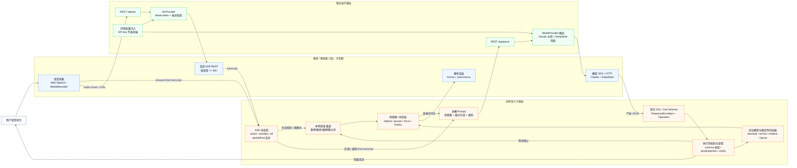

# Voice-Canvas 整体架构图

> 本图用于说明 Voice-Canvas 的核心数据流，以及"框架负责手和眼，自研层负责大脑"的边界。T5 起补充后端 ASR 层，但语义编译和执行层契约不变。

## 分层说明

| 数据流层 | 主要职责 | 边界 |
|---|---|---|
| 语音采集层 | 接收用户语音，输出 transcript | 浏览器 ASR 或后端百度 ASR 提供原始识别能力；ASR provider、状态机、60 秒上限保护由项目自研 |
| 语义编译层 | 把自然语言和场景上下文编译为结构化 JSON 操作 | LLM 负责语言理解；Prompt、DSL、Zod 校验由项目自研 |
| 场景图 / 状态层 | 保存 objects、groups、focus、history、pendingAction | 这是渲染真相与上下文记忆的核心自研层 |
| 执行渲染层 | 把操作落到画布，并按场景图渲染 | Konva 负责绘制；布局器、执行前校验、容错规则由项目自研 |
| 模型调度层 | 后端注入 key，按模型路由并自动兜底 | Express 只是薄代理；Provider 路由和 failover 是项目控制逻辑 |
| 后端 ASR 层 | 后端藏百度 key，调用短语音识别，返回 transcript | 百度只负责语音转文字；录音窗口、格式校验、失败不执行由项目控制 |
